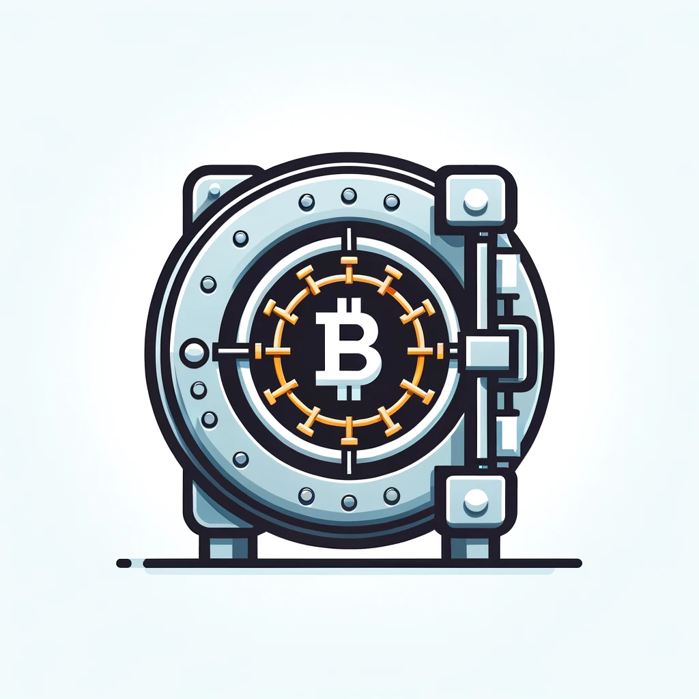

# Crypto Vault (off-chain)
#### Version 0.1.0

[](https://github.com/yourusername/crypto-vault)
[]()
[](LICENSE)

<br/>
<p align="center">

</p>
<br/>

## About

Crypto Vault is a Python library designed to securely encrypt and store secrets on-chain. It facilitates 
off-chain encryption followed by on-chain storage through smart contracts, offering a robust solution for managing 
sensitive data in blockchain applications.

Currently deployed on the Polygon Mumbai testnet only.

## Requirements
- Python 3.9^
- Polygon wallet with enough MATIC to pay gas
- HTTP provider URL (Polygon-mumbai RPC)

## Installation

```bash
pip install crypto-vault
```

## Usage

### Basic Workflow:

1. Initialize Crypto Vault with a private key and HTTP provider.
2. Store, retrieve, and update secrets on-chain.
3. Encrypt and decrypt data off-chain.

<details>
<summary>Code Examples</summary>

Generate secure encryption key with Encryption
```python
from crypto_vault import Encryption

# Generate encryption key
encryption_key = Encryption.generate_key()
```

Initialize Crypto Vault:
```python
from crypto_vault.crypto_vault import CryptoVault

crypto_vault = CryptoVault(
        app="myApp",
        env="prod",
        private_key="private_key",
        encryption_key=encryption_key,
        http_provider="http-provider-url-with-api-key",
)
```

Store, retrieve, and update secrets
```python
# Store
crypto_vault.store(data={"password": "secret", "foo": "bar"})

# Retrieve secrets
secrets = crypto_vault.retrieve()

# Retrieve single secret
password = crypto_vault.retrieve(value_name="password")

# Update single secret
crypto_vault.update(data={"foo": "Hello world!"})

# Update secrets -> To update all secrets use crypto_vault.store()
```

Encrypt and decrypt data
```python
# Encrypt
encrypted_data = crypto_vault.encrypt(data="secret")

# Decrypt
decrypted_data = crypto_vault.decrypt(data=encrypted_data)
```


   
</details>

## Crypto Vault API

1. Storage
   - Store data. Input parameters: data(k: v)
   - Retrieve data. Params: value_name(optional)
   - Update parameter. Params: data
2. Encryption
   - Generate encryption key
   - Encrypt data(str, int, list, dict). Params: value, key
   - Decrypt data(bytes32). Params: value, key

## Crypto Vault Smart Contract

The smart contract is designed to store encrypted data on-chain. It is deployed on the Polygon Mumbai testnet.

[Crypto Vault Smart Contract on mumbai-polygonscan](https://mumbai.polygonscan.com/address/0x276c89d95300b11b8aceae24a2dbc4bc3bab69f5#code)
